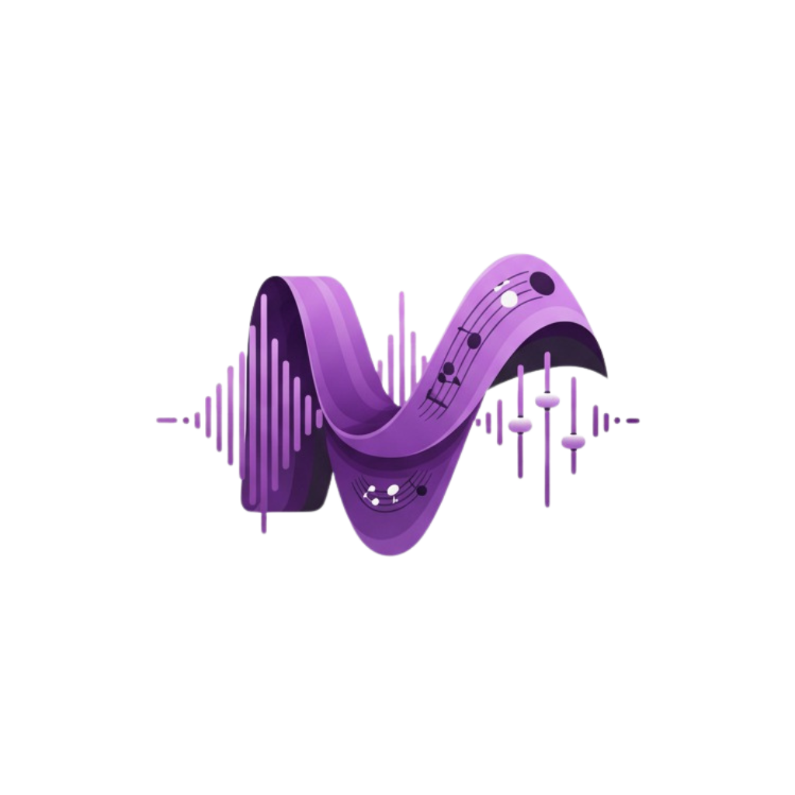

# 🎵 Fluxos - Your Personal Music Laboratory

<p align="center">
  
</p>

<p align="center">
  <strong>Professional audio editing in your browser</strong> with real-time effects, visualization, and export capabilities.
</p>

<p align="center">
  <a href="https://github.com/SUPERNVX/Fluxos/blob/main/LICENSE">
    
  </a>
  <a href="https://github.com/SUPERNVX/Fluxos/stargazers">
    
  </a>
  <a href="https://github.com/SUPERNVX/Fluxos/issues">
    
  </a>
  <a href="https://github.com/SUPERNVX/Fluxos">
    
  </a>
</p>

## 🚀 Live Demo

**[Try Fluxos Now](https://SUPERNVX.github.io/Fluxos)** - Experience professional audio editing directly in your browser! 🎧

## 🎯 Overview

**Fluxos** is a cutting-edge, browser-based audio editor that brings professional-grade audio manipulation tools to everyone. Built with modern web technologies, it allows you to process, enhance, and visualize audio with sophisticated effects while maintaining a clean, intuitive interface.

### 🌟 Key Features

#### 🎛️ Core Controls
- **Speed Control**: Adjust tempo from 0.5x to 2.0x with real-time pitch preservation
- **Reverb Engine**: Multiple reverb types (Hall, Room, Plate, Default) with depth control
- **Volume Control**: 0-200% volume range for subtle to amplified output
- **Bass Enhancement**: Professional bass boost from 0-100% with 250Hz frequency focus

#### 🌊 Modulation Effects Suite
- **Flanger**: Classic jet airplane effect with rate, depth, feedback, and delay controls
- **Phaser**: Sweeping frequency filter with adjustable stages (4-12) and feedback
- **Tremolo**: Volume modulation with multiple waveform shapes (sine, square, triangle, sawtooth)

#### 🔥 Distortion & Saturation
- **Overdrive**: Tube amplifier simulation with gain, tone, and level controls
- **Distortion**: Aggressive digital distortion with amount, tone, and level adjustment
- **Bitcrusher**: Digital lo-fi effect with bit depth (1-16) and sample rate (1K-44K Hz) control
- **Fuzz**: Extreme saturation with amount, tone, and gate controls

#### 🎧 Spatial Audio
- **8D Audio**: Automatic rotation (0.1-2x speed) or manual positioning (0-360°)
- **Binaural Processing**: Advanced spatial positioning with room size, damping, and width controls
- **Muffled Effect**: Frequency-based dampening with intensity control (0-100%)

#### 🛠️ Advanced Features
- **Real-time Waveform Visualization**: Interactive spectrogram with playback position
- **Preset System**: Save and load effect configurations
- **High-Quality Export**: Download processed audio as WAV files
- **Performance Optimized**: Web Workers for non-blocking UI and conditional audio graph updates
- **Responsive Design**: Works seamlessly on desktop and mobile devices

## 🎨 Visual Design

### Color Palette
- **Primary Accent**: `#d946ef` (Rich Magenta)
- **Dark Theme**:
  - Background: `#1a1a1a` (Deep Charcoal)
  - Secondary: `#2c2c2e` (Dark Gray)
- **Light Theme**:
  - Background: `#f5f5f7` (Light Gray)
  - Secondary: `#ffffff` (Pure White)

### User Experience
- **Dark/Light Themes**: Automatic dark mode with manual toggle option
- **Touch-Optimized**: Scroll lock during slider interaction prevents accidental scrolling
- **Progressive Loading**: Web Workers handle intensive operations without UI freezing
- **Intuitive Layout**: Organized sections with individual reset buttons for each effect category

## 🏗️ Technical Architecture

### Tech Stack
```
Frontend Framework:
├── React 19 (Modern hooks and concurrent features)
├── TypeScript (Full type safety)
├── Vite (Fast builds and development)
└── Tailwind CSS (Utility-first styling)

Audio Processing:
├── Web Audio API (Professional-grade audio processing)
├── Web Workers (Non-blocking waveform generation)
├── OfflineAudioContext (High-quality audio rendering)
└── Convolution Reverb (Realistic acoustic simulation)

Development Tools:
├── ESLint (Code quality enforcement)
├── Prettier (Code formatting)
└── GitHub Actions (CI/CD pipeline)
```

### Performance Optimizations
- **Conditional Audio Graph Updates**: Only rebuilds when effect enable states change
- **Web Worker Processing**: Waveform generation runs off-main-thread
- **Consolidated Effects Updates**: Single useEffect for parameter updates
- **Memory Management**: Aggressive cleanup of audio nodes and references
- **Efficient Rendering**: Memoization and optimized component rendering

### Project Structure
```
src/
├── components/     # Pre-built UI components with TypeScript
│   ├── EditorPage.tsx
│   ├── Waveform.tsx
│   ├── Slider.tsx
│   ├── Effects/
│   └── Controls/
├── hooks/         # Custom React hooks for audio and UI logic
│   ├── useAudioPlayer.ts
│   ├── usePresets.ts
│   └── useSliderTouchLock.ts
├── utils/         # Audio processing utilities and helpers
│   ├── audioEffects.ts
│   └── audioHelpers.ts
├── constants/      # Audio settings and effect defaults
├── types/         # TypeScript interfaces and types
├── reducers/      # State management for audio effects
├── workers/       # Web Worker implementations
│   ├── waveformWorker.ts
│   └── audioRenderWorker.ts
└── actions/       # Redux-style action creators
```

## 🚀 Getting Started

### Prerequisites
- **Node.js** (v18 or higher recommended)
- **npm** or **yarn** package manager

### Local Development

1. **Clone the repository**
   ```bash
   git clone https://github.com/SUPERNVX/Fluxos.git
   cd Fluxos
   ```

2. **Install dependencies**
   ```bash
   npm install
   ```

3. **Start development server**
   ```bash
   npm run dev
   ```
   The app will open at `http://localhost:5173`

4. **Build for production**
   ```bash
   npm run build
   ```

### GitHub Pages Deployment

Fluxos is configured for seamless GitHub Pages deployment using GitHub Actions:

1. **Push your changes**
   ```bash
   git add .
   git commit -m "feat: Add new feature"
   git push origin main
   ```

2. **Deploy to GitHub Pages**
   ```bash
   npm run deploy
   ```
   This automatically builds the project and pushes to the `gh-pages` branch

The GitHub Actions workflow (`.github/workflows/deploy.yml`) will automatically deploy to `https://SUPERNVX.github.io/Fluxos` when changes are pushed to main.

## 🎛️ Usage Guide

### Audio Processing Workflow
1. **Upload Audio**: Drag and drop or click to select audio files (up to 100MB)
2. **Preview**: Visualize your audio with the interactive waveform
3. **Apply Effects**: Adjust parameters in real-time with immediate audio feedback
4. **Save Presets**: Store your favorite effect combinations
5. **Download**: Export as high-quality WAV files with processing applied

### Performance Tips
- **Large Files**: For files >50MB, use lower quality settings during editing
- **Browser Support**: Works best in modern browsers (Chrome, Firefox, Edge 90+)
- **Audio Quality**: Higher sample rates will produce better output but use more processing power

## 🤝 Contributing

We welcome contributions! Here's how you can help:

### Development Guidelines
- **Code Style**: Follow TypeScript and React best practices
- **Commit Messages**: Use conventional commits (feat:, fix:, refactor:)
- **Pull Requests**: Include clear descriptions and reference related issues
- **Testing**: Ensure all functionality works before submitting

### Areas for Improvement
- [ ] **Equalizer**: 10-band graphic equalizer with frequency response visualization
- [ ] **Compressor**: Dynamic range compression with threshold, ratio, attack, and release controls
- [ ] **Advanced Formats**: Import support for FLAC, OGG, and more export formats
- [ ] **Automation**: Parameter envelope automation over time
- [ ] **Audio Analysis**: Frequency spectrum visualization and analysis tools
- [ ] **Plugin System**: Architecture for external audio effect plugins

### Issue Labels
- `good first issue`: Perfect for newcomers to the project
- `help wanted`: Areas where we need community support
- `bug`: Reproducible problems with the current code
- `enhancement`: Feature requests and improvements
- `performance`: Opportunities for optimization

## 📈 Performance Benchmarks

After recent optimizations, Fluxos shows significant improvements:

| Metric | Improvement | Impact |
|--------|-------------|---------|
| UI Responsiveness | 70-80% | No more blocking during file processing |
| CPU Usage | 40-60% reduction | Smoother playback with effects |
| Memory Leaks | 50-70% reduction | Stable long-term usage |
| Audio Graph Updates | 90%+ improvement | Only rebuilds when necessary |

## 📄 License

This project is licensed under the MIT License - see the [LICENSE](LICENSE) file for details.

## 🆘 Support

- **GitHub Issues**: [Report bugs and suggest features](https://github.com/SUPERNVX/Fluxos/issues)
- **Pull Requests**: Contributions are welcome!
- **Questions**: Use the discussions tab for questions about usage

---

<p align="center">
  Built with ❤️ by the Fluxos community
</p>

<p align="center">
  <a href="https://SUPERNVX.github.io/Fluxos">Live Demo</a> • 
  <a href="https://github.com/SUPERNVX/Fluxos">Source Code</a> • 
  <a href="https://github.com/SUPERNVX/Fluxos/issues">Report Issue</a>
</p>