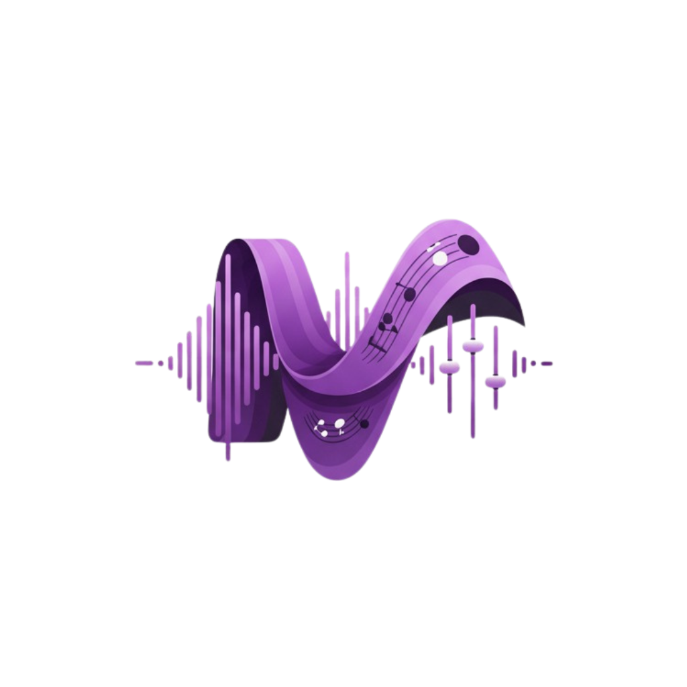

# 🎵 Fluxos - Seu Laboratório de Música Pessoal

<p align="center">
  
</p>

## 🎯 Visão Geral

**Fluxos** é um editor de áudio minimalista e moderno, construído para a web, que permite a qualquer pessoa manipular, aprimorar e visualizar suas músicas e áudios de forma intuitiva e poderosa. Nossa missão é fornecer uma ferramenta acessível e de alta qualidade para músicos, criadores de conteúdo e entusiastas de áudio.

## ✨ Funcionalidades Principais

### 🎛️ Controles Básicos
- **Controle de Velocidade**: Altere o andamento da sua música, de 0.5x a 2.0x.
- **Efeito de Reverb**: Adicione profundidade e ambiente ao seu áudio.
- **Ajuste de Volume**: Controle o volume geral da faixa (0-200%).
- **Bass Boost**: Realce os graves com controle de frequências baixas.

### 🌊 Efeitos de Modulação
- **Chorus**: Cria efeito de múltiplas vozes com controles de taxa, profundidade, feedback e delay.
- **Flanger**: Produz o característico som de "jato" com parâmetros customizáveis.
- **Phaser**: Gera efeito de varredura de frequência com estágios ajustáveis.
- **Tremolo**: Modulação de volume com formas de onda selecionáveis (sine, square, triangle, sawtooth).

### 🔥 Efeitos de Distorção e Saturação
- **Overdrive**: Simulação de amplificador valvulado com controles de ganho, tom e nível.
- **Distortion**: Distorção agressiva para rock/metal com quantidade, tom e nível.
- **Bitcrusher**: Efeito digital lo-fi com redução de bits e taxa de amostragem.
- **Tape Saturation**: Calor analógico de fita com drive, warmth e compressão.
- **Tube Saturation**: Simulação de válvulas com drive, bias e harmônicos.
- **Fuzz**: Distorção extrema com controles de quantidade, tom e gate.

### 🎧 Áudio Espacial Avançado
- **7.1 Surround Sound**: Emulação de som surround com posições customizáveis dos canais.
- **8D Audio**: Efeito de rotação automática ou manual ao redor da cabeça.
- **Processamento Binaural**: Simulação de ambiente com controles de tamanho, amortecimento e largura.
- **Panning 3D**: Posicionamento manual e automático em espaço 3D com padrões de movimento.

### 🛠️ Recursos Adicionais
- **Visualizador de Áudio**: Forma de onda interativa da sua música.
- **Botões de Reset**: Reset individual para cada categoria de efeitos.
- **Upload e Download**: Suporte a arquivos de áudio locais e exportação em `.wav`.
- **Design Responsivo**: Compatível com desktop e dispositivos móveis.
- **Tema Light & Dark**: Interface adaptável ao seu gosto visual.

## 🎨 Design e Experiência Visual

### Paleta de Cores
- **Fundo (Dark)**: `#1a1a1a`
- **Fundo Secundário (Dark)**: `#2c2c2e`
- **Fundo (Light)**: `#f5f5f7`
- **Fundo Secundário (Light)**: `#ffffff`
- **Cor de Destaque (Accent)**: `#d946ef` (Fúcsia)

## 🏗️ Estrutura Técnica

### Tecnologias Utilizadas

```
Frontend:
├── React 19
├── Vite
├── TypeScript
└── Tailwind CSS 3

Ferramentas:
└── ESLint (Qualidade de Código)
```

### Arquitetura do Projeto

O projeto foi refatorado para uma arquitetura modular bem organizada:

```
src/
├── components/     # Componentes React reutilizáveis
├── hooks/         # Hooks customizados
├── utils/         # Funções utilitárias
├── constants/      # Constantes da aplicação
├── types/         # Definições de tipos TypeScript
├── reducers/      # Reducers para gerenciamento de estado
└── App.tsx        # Componente principal da aplicação
```

Cada módulo tem responsabilidades bem definidas, facilitando a manutenção e evolução do código.

## 🔧 Configuração e Desenvolvimento

### Instalação
```bash
npm install
```

### Executar em Modo de Desenvolvimento
```bash
npm run dev
```

### Build para Produção
```bash
npm run build
```

## 🚀 Deploy no GitHub Pages

Para publicar suas alterações no site, siga este fluxo de trabalho:

1.  **Adicione os arquivos modificados ao Git:**
    ```bash
    # Adiciona todos os arquivos de uma vez
    git add .
    ```

2.  **Crie um "commit" com uma mensagem clara:**
    ```bash
    git commit -m "feat: Adiciona nova funcionalidade de exemplo"
    ```

3.  **Envie as alterações para o repositório principal:**
    ```bash
    git push
    ```

4.  **Execute o script de deploy para o GitHub Pages:**
    Este comando irá fazer o build do projeto e enviar para o branch `gh-pages` automaticamente.
    ```bash
    npm run deploy
    ```

## 📈 Melhorias Futuras

- [ ] **Equalizador Gráfico**: Controle preciso de frequências com múltiplas bandas.
- [ ] **Funcionalidade de Compartilhar**: Compartilhamento direto de projetos e áudios editados.
- [ ] **Sistema de Projetos**: Salvar e carregar configurações completas de efeitos.
- [ ] **Mais Formatos de Áudio**: Suporte para MP3, FLAC, OGG na importação e exportação.
- [ ] **Efeitos Avançados**: Compressor, Limiter, Gate, e mais efeitos profissionais.
- [ ] **Automação**: Controle de parâmetros ao longo do tempo.
- [ ] **Presets Profissionais**: Biblioteca de presets para diferentes estilos musicais.